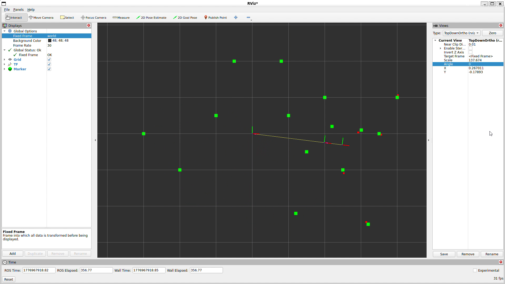

# 🔗 ROS2 tf2 Perception Pipeline

This project explores **coordinate transformations and perception in robotics** using ROS2 and tf2.

Instead of just passing messages, it simulates how a robot **observes the world through a sensor** and reconstructs it.

---

## 🧠 Core Idea

Robots don’t perceive the world directly.

They observe it through sensors, in their own coordinate frame, and must transform that data into a global frame.

This project demonstrates:
World → Sensor → World


---

## ⚙️ Pipeline

1. **Define obstacles in the world frame**
2. **Transform them into the sensor frame** (simulate measurement)
3. **Apply constraints**:
   - Field of View → only front-facing points (x > 0)
   - Range limit → r ≈ 3m
   - Noise → small random perturbations
4. **Transform back into world frame** (reconstruction)

---

## 📊 Visualization

- 🟢 **Green** → Ground truth (actual positions in world)
- 🔴 **Red** → Reconstructed from sensor data

This is visualized in RViz.

---


## 🧠 Key Learnings

- tf2 manages **spatial relationships over time**
- Sensor data is always **relative and imperfect**
- Even with correct transforms, perception ≠ reality
- Errors in sensing or pose affect the entire reconstruction

---

## 🚀 How to Run

```bash
cd ~/ros2_ws
colcon build --symlink-install
source install/setup.bash

# Run broadcaster
ros2 run tf2_project broadcaster

# Run listener
ros2 run tf2_project listener

# Open RViz
rviz2
```
## 🛠 Tech Stack
ROS2 (rclpy)
tf2
RViz2

## Future Improvements
Increase scan density (LiDAR-like simulation)
Add pose estimation error
Simulate moving obstacles
Build a basic mapping layer

## author
Tannishth Gupta